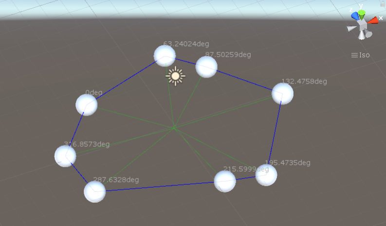

# 2POC
Recovering two old pieces of code.

## 1. Typescript
A utility for asynchronous object creation.

Target Functionality:
```typescript
let fooPromise: Promise<Foo> = Foo.createAsync(/*constructor params*/);
```

Link: https://github.com/impproductions/2POC/tree/master/typescript/async-object-creation

## 2. Unity (C#)
Components to connect dots to create a fence.



Link: https://github.com/impproductions/2POC/tree/master/unity

Relevant scripts: https://github.com/impproductions/2POC/tree/master/unity/dots-to-circles/Assets/Scripts

Unity version: Unity 2019.4.19f1 (64-bit) (recommended)

## License
Whatever :D